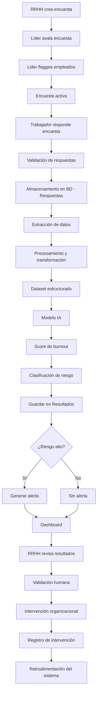
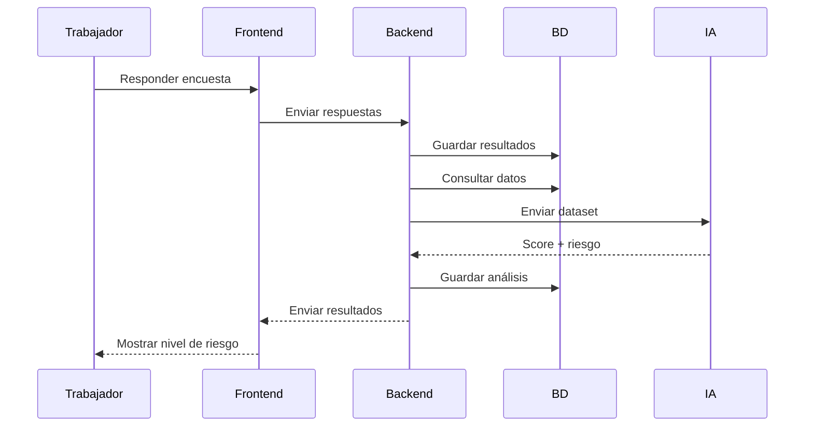
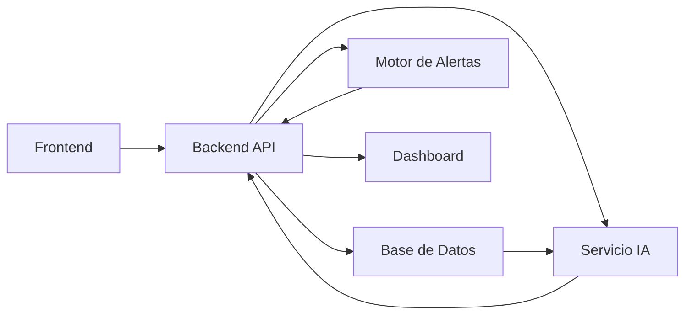
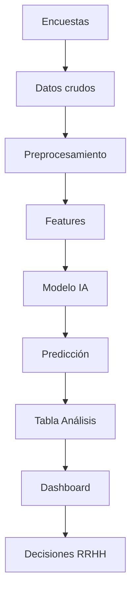
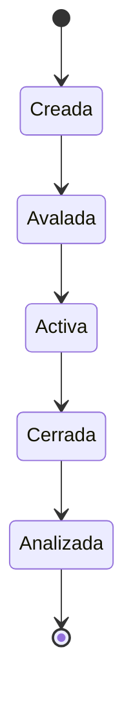
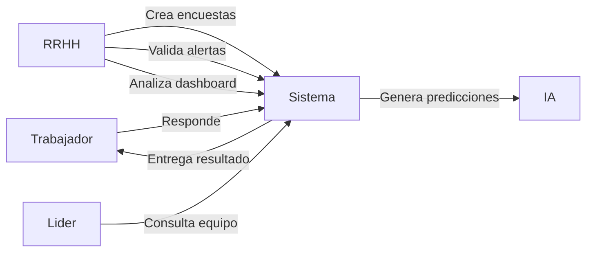
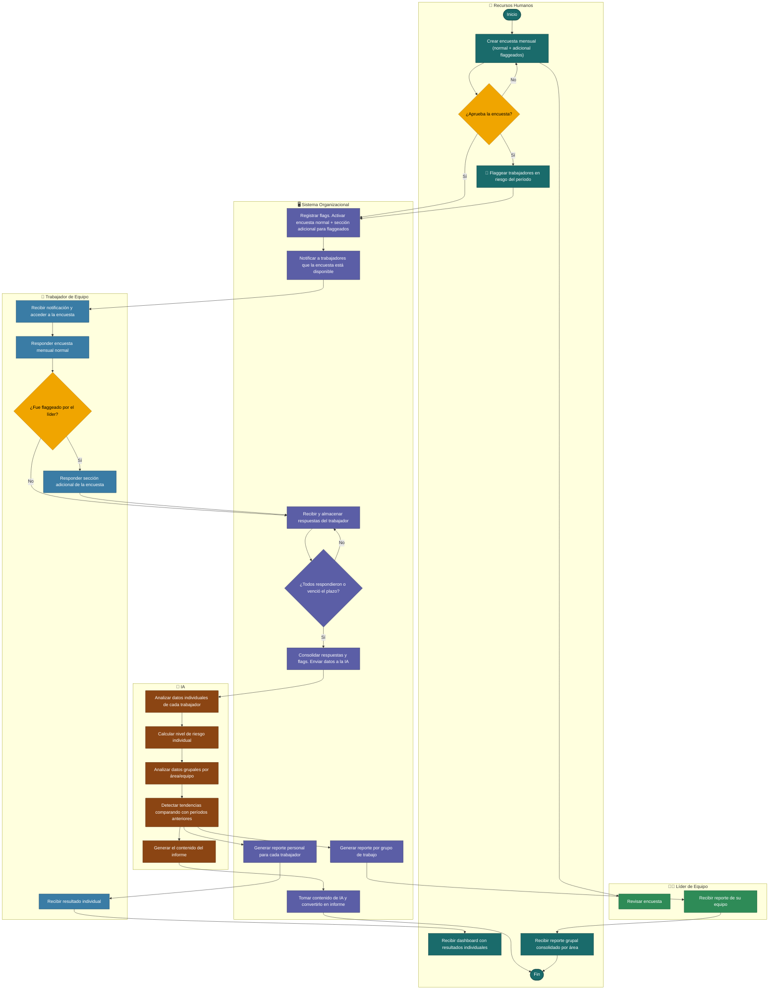

# Diagrama de actividad
Flujo general end-to-end

# Diagrama de Secuencia (interacción entre componentes)
Se aprecia cada capa durante el proceso

# Diagrama de Arquitectura
Diagrama de alto nivel (sin detallar mucho)

# Diagrama de flujo de datos

# Diagrama de estado
Ciclo de vida de una encuesta

# Diagrama de caso de uso simplificado

# Diagrama de flujo de aplicación con componentes

