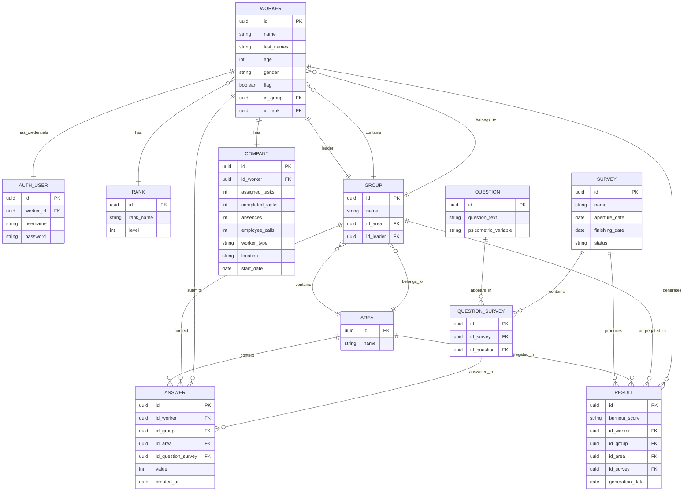

```mermaid
erDiagram

    WORKER {
        uuid id PK
        string name
        string last_names
        int age
        string gender
        boolean flag
        uuid id_group FK
        uuid id_rank FK
    }

    AUTH_USER {
        uuid id PK
        uuid worker_id FK
        string username
        string password
    }

    RANK {
        uuid id PK
        string rank_name
        int level
    }

    GROUP {
        uuid id PK
        string name
        uuid id_area FK
        uuid id_leader FK
    }

    AREA {
        uuid id PK
        string name
    }

    COMPANY {
        uuid id PK
        uuid id_worker FK
        int assigned_tasks
        int completed_tasks
        int absences
        int employee_calls
        string worker_type
        string location
        date start_date
    }

    SURVEY {
        uuid id PK
        string name
        date aperture_date
        date finishing_date
        string status
    }

    QUESTION {
        uuid id PK
        string question_text
        string psicometric_variable
    }

    QUESTION_SURVEY {
        uuid id PK
        uuid id_survey FK
        uuid id_question FK
    }

    ANSWER {
        uuid id PK
        uuid id_worker FK
        uuid id_group FK
        uuid id_area FK
        uuid id_question_survey FK
        int value
        date created_at
    }

    RESULT {
        uuid id PK
        string burnout_score
        uuid id_worker FK
        uuid id_group FK
        uuid id_area FK
        uuid id_survey FK
        date generation_date
    }

    %% RELACIONES

    WORKER ||--|| AUTH_USER : has_credentials

    WORKER }o--|| GROUP : belongs_to
    WORKER }o--|| RANK : has
    GROUP ||--o{ WORKER : contains
    GROUP ||--|| WORKER : leader

    GROUP }o--|| AREA : belongs_to
    AREA ||--o{ GROUP : contains

    WORKER ||--|| COMPANY : has

    SURVEY ||--o{ QUESTION_SURVEY : contains
    QUESTION ||--o{ QUESTION_SURVEY : appears_in

    QUESTION_SURVEY ||--o{ ANSWER : answered_in

    WORKER ||--o{ ANSWER : submits
    GROUP ||--o{ ANSWER : context
    AREA ||--o{ ANSWER : context

    WORKER ||--o{ RESULT : generates
    GROUP ||--o{ RESULT : aggregated_in
    AREA ||--o{ RESULT : aggregated_in
    SURVEY ||--o{ RESULT : produces
```
